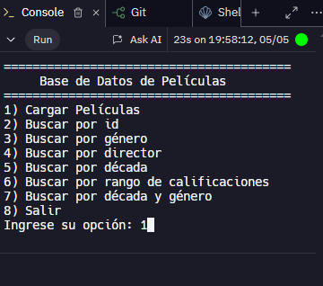
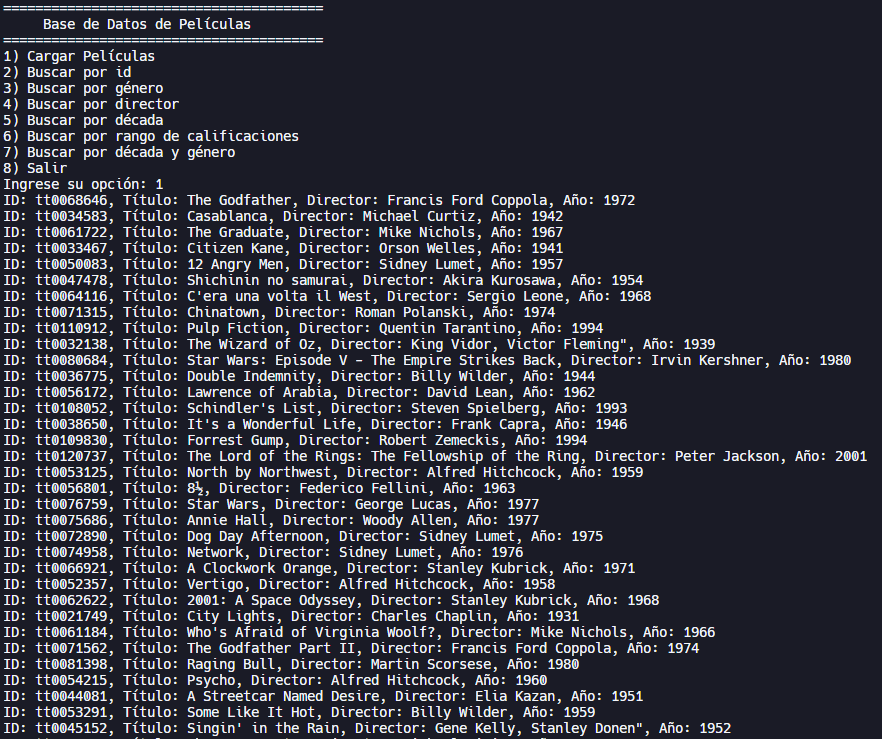
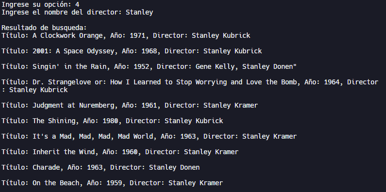
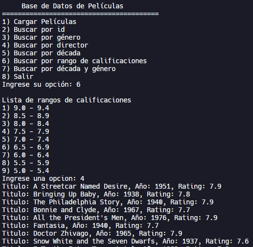

Buscador de Peliculas por distintos criterios.
=====

---
**Descripcion**
---

Este es un programa que implementa una base de datos de peliculas utilizando estructuras de datos, en este caso se hizo uso de listas y mapas. Dentro de sus funciones principales se encuentra la opcion de cargar estos datos desde un archivo .csv, buscar las peliculas registradas por diferentes criterios como ID, genero, director y rango de calificaciones.

Compilacion y ejecucion del codigo
--
- Para lo siguiente es necesario tener un compilador de C compatible con las bibliotecas estandar de C.
1. Clona o descargar este repositorio.
2. Asegurarse de que el archivo .csv se encuentre en el formado adecuado y sus datos sean validos.
3. Compilar el programa en el compilador de C instalado.
4. Ejecutar el programa compilado.
5. Leer atentantamente el menu y seguir las instrucciones de cada opcion para interactuar con la base de datos de peliculas.

**Importante elegir la opcion 1) Cargar peliculas, antes de interactuar con cualquier otra opcion.**

---
Funcionalidades
---
- Registrar peliculas desde un archivo .csv que viene integrado en los archivos del programa.
- Busqueda de las peliculas por el id registrado.
- Busqueda por genero.
- Busqueda por director.
- Busqueda por decada.
- Busqueda por rango de calificaciones.
- Busqueda por decada y genero.
 
**Problemas conocidos**
-
- La funcion de busqueda por director, no puedo hacer las busqueda si se ingresa el nombre junto con el apellido. Esta funcion solo funciona correctamente si se busca o el nombre o el apellido del director.

---
Ejemplos de uso
---
**Primer paso y mas importante**

Escribir 1, al ingresar una opcion para evitar errores.
Esto leera el archivo .csv antes mencionado.

El sistema entregara una lista de todas las peliculas registradas como se muesta a continuacion.

**Luego de esto se pueden usar las siguientes opciones del menu con libertad 
ejemplos de algunas funciones :**

- Opcion 4) Buscar por director.
 

- Opcion 6) Buscar por rango de calificaciones.
 

---
Contribuciones
---
**Daniela Vallejos:**
- Implemento funcion director
- Implementacion de codigo faltante para la lectura de los generos.
- Implementacion de funciones para borrar comillas y pasar un string de generos a una lista.
- Diseño y redaccion del README.

**Hugo Gonzalez:**
- Implemento de funcion busqueda de generos(correciones).
- Implementacion de funcion de busqueda por rango de calificaciones e instruccion de mapa vacio en cada funcion.
- Implementacion de funciones de busqueda  por decada, decada y genero.
- Documentacion y comentarios dentro del codigo.
- Correcion de errores para reconocer minusculas en las funciones de busqueda.
